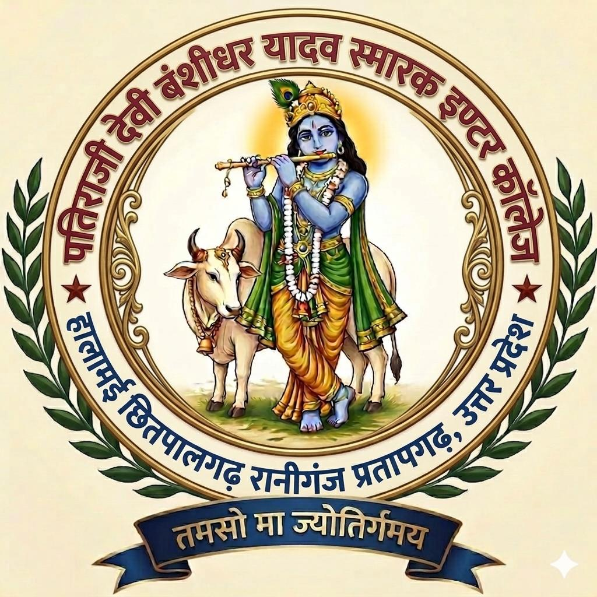

<div align="center">
  

  <h1>Patiraji Devi Vanshidhar Yadav Smarak Inter College Website</h1>

  <p>
    A premium, responsive, Hindi-first institutional website for
    <strong>पातिराजी देवी वंशीधर यादव स्मारक इण्टर कॉलेज</strong>,
    Halamai, Chhitpalgarh, Raniganj, Pratapgarh, Uttar Pradesh.
  </p>

  <p>
    <strong>Professional design</strong> ·
    <strong>Responsive layout</strong> ·
    <strong>Hindi content</strong> ·
    <strong>Auto-moving gallery</strong>
  </p>
</div>

## Overview

This project is a modern static website designed for a school or college that needs a trustworthy, polished, and information-rich online presence. The website highlights the institution's identity, admission information, notices, facilities, photo gallery, downloads, and contact details in a clean Hindi interface.

The design focuses on a premium educational look with strong visual hierarchy, smooth interactions, mobile-friendly sections, and real college imagery.

## Key Features

- Premium full-screen hero section with college branding and call-to-action buttons
- Sticky responsive navigation for desktop and mobile
- Hindi-first content structure for students, parents, and visitors
- Principal/message section with institutional information
- Important notices and admission information cards
- Facilities section for academics, student support, environment, activities, and office help
- Auto-moving photo gallery slider with student and activity images
- Downloads table for notices, forms, exam details, and office information
- Contact section with address, school code, establishment year, and office timing
- Smooth reveal animations and polished hover interactions
- Fully responsive layout for mobile, tablet, and desktop

## Technology Stack

This website is built with simple, fast, and deployment-friendly frontend technologies:

- HTML5
- CSS3
- Vanilla JavaScript
- Responsive design
- Static assets

No build tools, frameworks, or database are required.

## Project Structure

```text
College Website/
├── assets/
│   ├── college-logo.jpeg
│   ├── college-building.jpeg
│   ├── principal.jpeg
│   ├── gallery-01.jpeg
│   ├── gallery-02.jpeg
│   ├── gallery-03.jpeg
│   ├── gallery-04.jpeg
│   ├── gallery-05.jpeg
│   ├── gallery-06.jpeg
│   ├── gallery-07.jpeg
│   ├── gallery-08.jpeg
│   ├── gallery-09.jpeg
│   └── gallery-10.jpeg
├── index.html
├── styles.css
├── script.js
└── README.md
```

## Main Sections

### Home

The homepage opens with a premium visual hero section using the college building image, college name, location, and quick action buttons.

### About and Message

The message section presents the institution's purpose, discipline, values, student development approach, and key college details.

### Notice Board

The notice area highlights important admission and examination updates in a clean card format.

### Admission

The admission section provides information about new admissions, regular students, and student assistance.

### Facilities

The facilities section presents academic structure, student help, green campus initiatives, activity-based learning, and parent-office communication.

### Photo Gallery

The gallery uses a self-moving horizontal slider to showcase student achievements, educational tours, tree plantation, events, and school activities.

### Downloads

The downloads section lists important notices, forms, scholarship information, examination instructions, and office support documents.

### Contact

The contact section displays the school address, school code, establishment year, and office timing.

## Local Setup

Clone the repository:

```bash
git clone https://github.com/akashrajput2433/College-Website.git
```

Open the project folder:

```bash
cd College-Website
```

Run a local static server:

```bash
python -m http.server 8000
```

Open in your browser:

```text
http://localhost:8000
```

You can also open `index.html` directly in a browser for a quick preview.

## Customization

To update the website content:

- Edit text content in `index.html`
- Update colors, layout, spacing, and animations in `styles.css`
- Update menu, scroll, and animation behavior in `script.js`
- Replace images inside the `assets/` folder while keeping the same file names

Recommended image usage:

- `college-logo.jpeg` for the logo
- `college-building.jpeg` for the hero image
- `principal.jpeg` for the principal section
- `gallery-01.jpeg` to `gallery-10.jpeg` for the moving gallery

## Deployment

This is a static website and can be deployed easily on:

- GitHub Pages
- Netlify
- Vercel
- Any static hosting service

For GitHub Pages:

1. Push the project to GitHub.
2. Open repository settings.
3. Go to Pages.
4. Select the `main` branch.
5. Save and publish.

## Design Goals

The website is designed to feel:

- Premium
- Trustworthy
- Fast
- Clean
- Professional
- Institution-focused
- Easy to use on mobile

## Repository

GitHub repository:

```text
https://github.com/akashrajput2433/College-Website
```

## License

This project is created for educational and institutional website use. Update the license section according to the final ownership and distribution policy of the institution.
